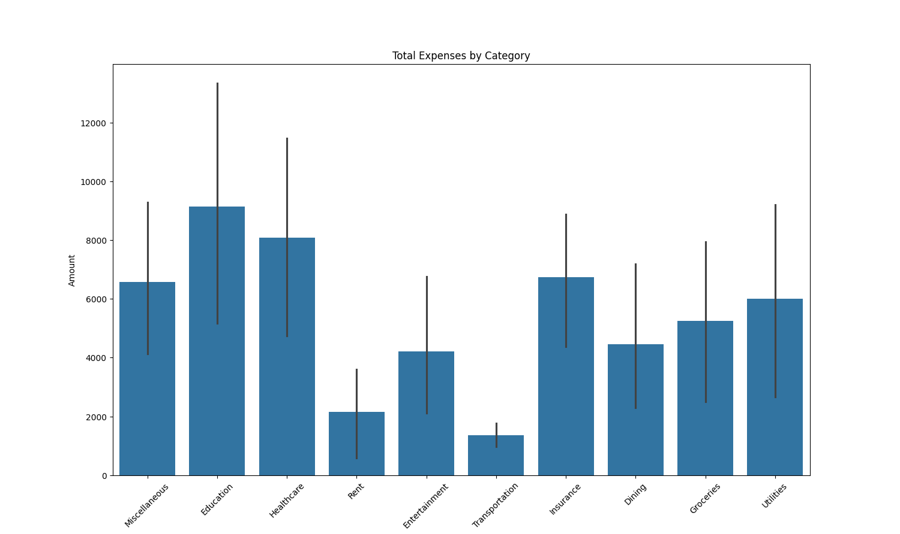
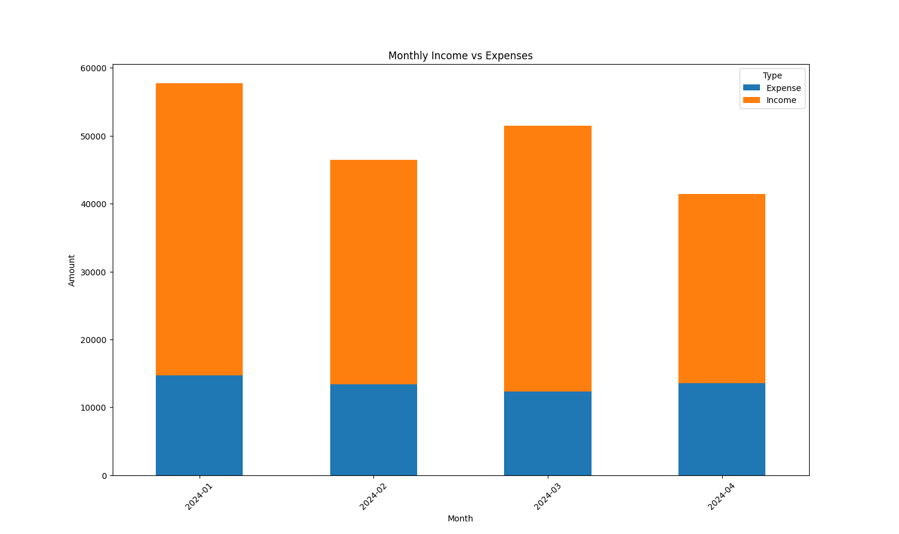

# 📊 Personal Finance Tracker: Data Analysis & Visualization

> **Track your finances, analyze spending habits, and visualize your financial health—all in one place!**

---

## ✨ Overview
This project provides a **simple yet powerful** way to:

- Track income and expenses effectively.
- Analyze your spending habits with intuitive data analysis.
- Visualize financial insights clearly through interactive graphs and charts.

---

## 🔥 Features
- **Expense Tracking:** Quickly record transactions and categorize expenses.
- **Data Analysis:** Understand your spending patterns, set budgets, and identify saving opportunities.
- **Visual Insights:** Leverage beautiful, informative visualizations using `Matplotlib` and `Seaborn` to make informed decisions.
- **User-Friendly:** Easy-to-use command-line interface.

---

## ⚙️ Technologies Used
- **Python**
- **Pandas** (Data manipulation)
- **Matplotlib & Seaborn** (Visualization)
- **NumPy** (Numerical computations)

---

## 🚧 Project Structure
```
├── data/
│   └── finance_data.csv
├── scripts/
│   ├── tracker.py
│   └── analysis.py
├── visualizations/
│   ├── spending_chart.png
│   └── monthly_summary.png
├── .gitignore
├── requirements.txt
└── README.md
```

---

## 🛠️ Installation & Usage

### Setup the project environment:

```bash
git clone <your-repository-url>
cd personal-finance-tracker
python -m venv venv
source venv/bin/activate  # On Windows: venv\Scripts\activate
pip install -r requirements.txt
```

### Run the Application:

```bash
python scripts/tracker.py
```

---

## 📸 Screenshots
### Spending Chart


### Monthly Summary


---

## 🤝 Contributing
Contributions, feature requests, and improvements are welcome! Feel free to fork the repository and submit pull requests.

---

## 📄 License
This project is licensed under the MIT License - see the [LICENSE](LICENSE) file for details.
